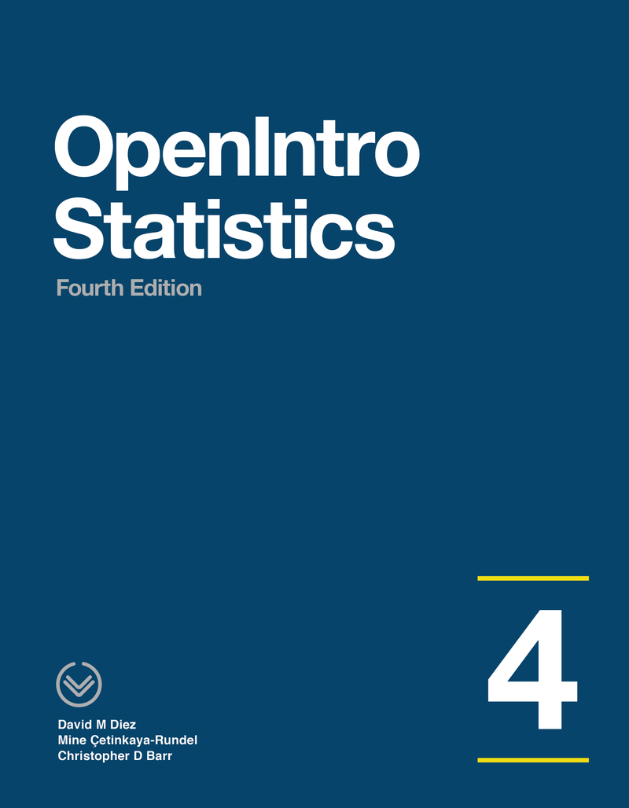
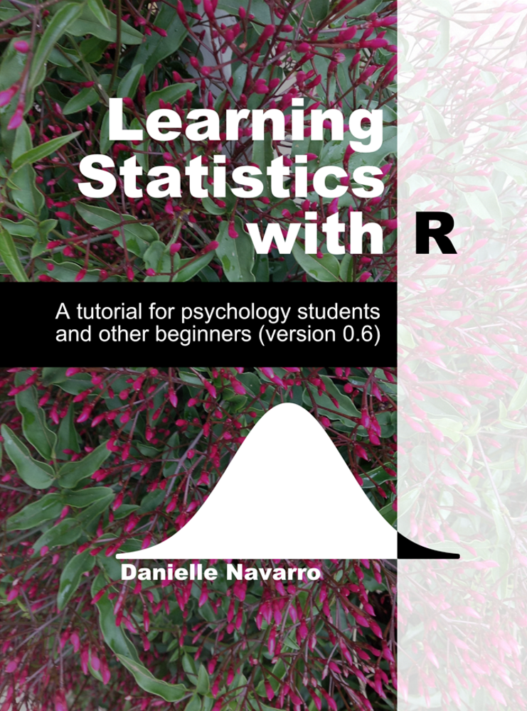
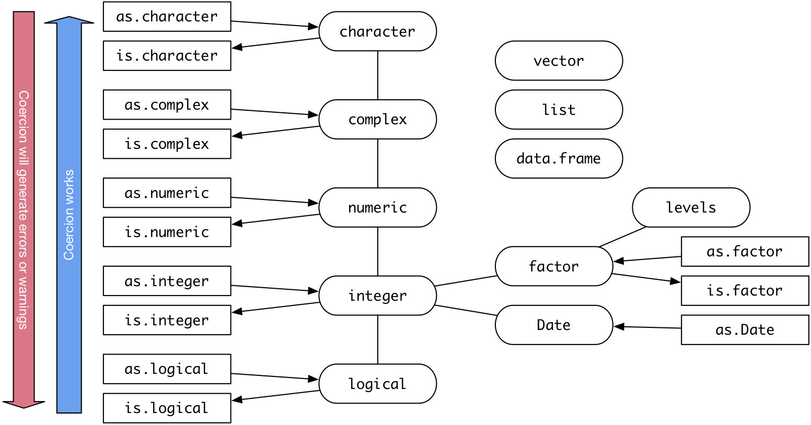

```{r setup, include = FALSE}
# remotes::install_github("gadenbuie/countdown")
# remotes::install_github("mitchelloharawild/icon")
# icon::download_fontawesome()
library(knitr)
library(tidyverse)
library(countdown)

# knitr::opts_chunk(message = FALSE, warning = FALSE)

opts_chunk$set(digits = 3)

# This style was adapted from Max Kuhn: https://github.com/rstudio-conf-2020/applied-ml
# And Rstudio::conf 2020: https://github.com/rstudio-conf-2020/slide-templates/tree/master/xaringan
# This slide deck shows a lot of the features of Xaringan: https://www.kirenz.com/slides/xaringan-demo-slides.html

# To use, add this to the slide title:   `r I(hexes(c("DATA606")))`
# It will use images in the images/hex_stickers directory (i.e. the filename is the paramter)
hexes <- function(x) {
  x <- rev(sort(x))
  markup <- function(pkg) glue::glue('')
  res <- purrr::map_chr(x, markup)
  paste0(res, collapse = "")
}
```


class: hide-logo, bottom, right, title-slide
background-image: url(images/Greetings_from_Statistics.jpeg)
background-size: contain

.font70[

[@skyetetra](https://twitter.com/ChelseaParlett/status/1340463322118856705)

]

---
# Agenda

* About your instructor
* Syllabus
* Class meetups
* Course Schedule
* Assignments (how you will be graded)
	* Participation
	* Homework
	* Labs
	* Data Project
	* Final exam
* Software
	* Getting started with R
	* The `DATA606` R Package
	* Using R Markdown

---

# Introduction

A little about me:

* Assistant Professor at CUNY in Data Science and Information Systems
* Principal Investigator for a Department of Education Grant (part of their FIPSE First in the World program) to develop a Diagnostic Assessment and Achievement of College Skills ([www.DAACS.net](http://www.daacs.net))  
* Authored over a dozen R packages including:
	* [likert](http://github.com/jbryer/likert)
	* [sqlutils](http://github.com/jbryer/sqlutils)
	* [timeline](http://github.com/jbryer/timeline)
* Specialize in propensity score methods. Three new methods/R packages developed include:
	* [multilevelPSA](http://github.com/jbryer/multilevelPSA)
	* [TriMatch](http://github.com/jbryer/TriMatch)
	* [PSAboot](http://github.com/jbryer/PSAboot)
* Developer of a data dashboard for the NYS Office of Special Education and TAP for Data at Cornell University: https://data.osepartnership.org

---

# Also a Father...

```{r, out.width='65%', fig.align='center', echo=FALSE}
knitr::include_graphics('images/BoysFall2019.jpg')
```

---

# Runner...

<table border='0' width='100%'><tr><td>
<center></center>
</td><td>
<center></center>
</td></tr></table>

---

# And photographer.

```{r, out.width='80%', fig.align='center', echo=FALSE}
knitr::include_graphics('images/Sleeping_Empire.jpg')
```


---

# Syllabus `r hexes(c('blogdown', 'rmarkdown'))`

Syllabus and course materials are here: [https://epsy630.bryer.org](https://epsy630.bryer.org)

We will use Blackboard primary for submitting assignments only.

The site is built using the [Blogdown](https://bookdown.org/yihui/blogdown/) R package and hosted on [Github](https://github.com/jbryer/EPSY630Spring2021). Each page of the site has a "Improve this page" link at the bottom right, use that to start a pull request on Github.


---

# Class Meetings

We will have meetups on Tuesdays evenings at 4:30pm. 

Class meetings will be recorded and made available the next day on the [course website](https://epsy630.bryer.org/course-overview/meetups/).

**One Minute Papers** - Complete the one minute paper after each Meetup (whether you watch live or watch the recordings). It should take approximately one to two minutes to complete. This allows me to 1) verify you have attended/watch the meetup and 2) get feedback about what you learned and what you may still be unclear.  
Link: https://forms.gle/gY9SeBCPggHEtZYw6

.font60[

**Please note:** *Students who participate in this class with their camera on or use a profile image are agreeing to have their video or image recorded solely for the purpose of creating a record for students enrolled in the class to refer to, including those enrolled students who are unable to attend live.  If you are unwilling to consent to have your profile or video image recorded, be sure to keep your camera off and do not use a profile image. Likewise, students who un-mute during class and participate orally are agreeing to have their voices recorded.  If you are not willing to consent to have your voice recorded during class, you will need to keep your mute button activated and communicate exclusively using the "chat" feature, which allows students to type questions and comments live.*

]

---

# Schedule*

```{r schedule-setup, echo=FALSE, warning=FALSE, message=FALSE}
# devtools::install_github("gadenbuie/ggweekly")
library(ggweekly)
library(rlang) # Needed for the ggweekly.R script to work
library(configr)
library(ggplot2)
library(readxl)
library(lubridate)
library(googlesheets4)
library(likert)
library(scholar)
# library(kableExtra)

options(knitr.kable.NA = '')

semester <- 'Spring 2021'

palette <- c('#8dd3c7','#ffffb3','#bebada','#fb8072','#80b1d3','#fdb462',
			 '#b3de69','#fccde5','#d9d9d9','#bc80bd','#ccebc5','#ffed6f')

lastModified <- format(file.info('../Schedule.xlsx')[1,]$mtime, '%B %d, %Y %I:%M%p')

meetups <- read_excel('../Schedule.xlsx', sheet = 'Meetups')
meetups$day <- as.Date(meetups$Date)
meetups$label <- paste0('Meetup ', meetups$StartTime, '\n', meetups$Topic)
# meetups$label <- meetups$Topic
meetups$color <- '#4A235A'
meetups$fill <- NA

officeHours <- read_excel('../Schedule.xlsx', sheet = 'Office_Hours')
officeHours$day <- as.Date(officeHours$Date)
officeHours$label <- paste0('Office Hours\n', officeHours$StartTime, '')
officeHours$color <- '#145A32'
officeHours$fill <- NA

schedule <- rbind(meetups[,c('day', 'label', 'color', 'fill')],
				  officeHours[,c('day', 'label', 'color', 'fill')])

topics <- read_excel('../Schedule.xlsx', sheet = 'Schedule')
topics$Start <- as.Date(topics$Start)
topics$End <- as.Date(topics$End)
for(i in 1:nrow(topics)) {
	schedule <- rbind(schedule, data.frame(
		day = topics[i,]$Start,
		label = paste0(topics[i,]$Topic, '\n\n\n'),
		color = '#000000',
		fill = palette[i]
	))
	dates <- seq(topics[i,]$Start, topics[i,]$End, by = 'day')[-1]
	for(j in seq_along(dates)) {
		schedule <- rbind(schedule, data.frame(
			day = dates[j],
			label = NA,
			color = NA,
			fill = palette[i]
		))
	}
}

start_day <- lubridate::floor_date(min(meetups$day), "month")
end_day <- lubridate::ceiling_date(max(meetups$day), "month") - 1
```

.font80[

```{r printTopics, echo=FALSE, warning=FALSE, message=FALSE, results='asis'}
# topics$Start <- format(topics$Start, format = '%A, %B %d, %Y')
# topics$End <- format(topics$End, format = '%A, %B %d, %Y')
# knitr::kable(topics, format = 'html')

meetups$Date <- format(meetups$Date, format = '%A, %B %d, %Y')
knitr::kable(meetups[,c('Date', 'Topic')], format = 'html')
```

]

.font50[*Tentative. Subject to change.]
---

# Textbooks `r hexes(c('openintro'))`

.pull-left[

Diez, D.M., Barr, C.D., & Çetinkaya-Rundel, M. (2019). *OpenIntro Statistics (4th Ed)*.

.font70[

This will be our primary textbook for most of the semesters. Our goal is to cover all the chapters.


]

.center[

<a href = "https://github.com/jbryer/DATA606Spring2021/blob/master/Resources/Textbooks/os4.pdf"></a>

]

]

.pull-right[

Navarro, D. (2018, version 0.6). *Learning Statistics with R*

.font70[

This textbooks has a chapter on Bayesian analysis that we will use at the end of the semester. 

]

.center[

<a href = "https://github.com/jbryer/DATA606Spring2021/blob/master/Resources/Textbooks/lsr-0.6.pdf"></a>

]

]

---

# Assignments

* [DAACS](https://spring2021.data606.net/assignments/daacs) (5%)
* [Participation](https://spring2021.data606.net/assignments/participation) (5%)
  * One Minute Papers
* [Homework](https://spring2021.data606.net/assignments/homework) (20%)
* [Labs](https://spring2021.data606.net/assignments/labs) (40%)
	* Labs are designed to introduce to you doing statistics with R.
	* Answer the questions in the main text as well as the "On Your Own" section.
* [Data Project](https://spring2021.data606.net/assignments/project) (20%)
	* This allows you to analyze a dataset of your choosing. Projects will be shared with the class. This provides an opportunity for everyone to see different approaches to analyzing different datasets.
* [Final exam](https://spring2021.data606.net/assignments/final/) (10%)

---

# Communication

* Slack Channel: https://epsy630spring2021.slack.com
	* [Click here to join the group](https://join.slack.com/t/epsy630-spring2021/shared_invite/zt-lrleoomo-82Zok02xEmF_dWIilEAkrA)
* Email: [jbryer@albany.edu](mailto:jbryer@albany.edu)
* Phone/Zoom: Please email to schedule a time to meet.
* Office hours will typically be:
	* Fridays from 12:00am to 1:00pm
	* I will use the same Zoom link that we use for the Tuesday night meetups.


---
# Familiarity with Statistical Topics `r hexes(c('googlesheets4'))`

```{r, echo = FALSE, cache = TRUE, message = FALSE, warning = FALSE}
results <- read_sheet('https://docs.google.com/spreadsheets/d/1HfAFxvGex_33GxKtIjJBdxDP2KVFjCAsIYhe6cTWlT4/edit#gid=1826761801') %>% as.data.frame()
mass.items <- c('I find math interesting.',
				'I get uptight during math tests.',
				'I think that I will use math in the future.',
				'Mind goes blank and I am unable to think clearly when doing my math test.',
				'Math relates to my life.',
				'I worry about my ability to solve math problems.',
				'I get a sinking feeling when I try to do math problems.',
				'I find math challenging.',
				'Mathematics makes me feel nervous.',
				'I would like to take more math classes.',
				'Mathematics makes me feel uneasy.',
				'Math is one of my favorite subjects.',
				'I enjoy learning with mathematics.',
				'Mathematics makes me feel confused.')
mass.results <- results[,4:17]
for(i in 1:ncol(mass.results)) {
	mass.results[,i] <- factor(mass.results[,i],
						  levels = c('Strongly Disagree', 'Disagree', 'Neutral',
						  		   'Agree', 'Strongly Agree'),
						  ordered = TRUE)
}
names(mass.results) <- mass.items

stats.items <- c('Descriptive Statistics',
                 'Probability',
                 'Data visualizations',
				 'Correlation',
                 'Central limit theorem',
                 'Null hypothesis testing',
				 'ANOVA',
				 'Chi-squared tests',
				 'Type I and II errors',
                 'Assumptions for regression',
                 'Linear regression',
                 'Multiple regression',
				 'Logistic regression',
                 'Predictive modeling',
                 'SPSS',
                 'R',
                 'Python')

stats.results <- results[,18:34]
for(i in 1:ncol(stats.results)) {
	stats.results[,i] <- factor(stats.results[,i],
						  levels = c('Not at all familiar', 'Sligtly familiar',
						  		     'Somewhat familiar',
						  		     'Moderately familiar', 'Extremely familiar'),
						  ordered = TRUE)
}
names(stats.results) <- stats.items
```


```{r, fig.width=12, fig.align='center'}
likert(stats.results) %>% plot(center = 2.5)
```

---
# Math Anxiety Survey Scale `r hexes(c('googlesheets4'))`

```{r, fig.width = 12, fig.align='center'}
likert(mass.results) %>% plot()
```


---
# Software `r hexes(c('rmarkdown', 'RStudio', 'tinytex'))`

This is an applied statistics course so we will make extensive use of the [R statistical programming language](https://www.r-project.org). You have two options for using R in this course:

* Use the R Studio server available here: [r.bryer.org](https://r.bryer.org/rstudio). I will email everyone a username and password (if you haven't received it, let me know).

* Install [R](https://cran.r-project.org) and [RStudio](https://rstudio.com) on your own computer. I encourage everyone to do this at some point by the end of the semester. I have instructions on the course website here: https://spring2021.data606.net/course-overview/software/

You will also need to have [LaTeX](https://www.latex-project.org) installed as well in order to create PDFs. The [`tinytex`](https://yihui.org/tinytex/) R package helps with this process:

```
install.packages('tinytex')
tinytex::install_tinytex()
```

---
# What is R?

"R is a language and environment for statistical computing and graphics. It is a GNU project which is similar to the S language and environment which was developed at Bell Laboratories (formerly AT&T, now Lucent Technologies) by John Chambers and colleagues..."

"R provides a wide variety of statistical (linear and non linear modeling, classical statistical tests, time-series analysis, classification, clustering, ...) and graphical techniques, and is highly extensible. The S language is often the vehicle of choice for research in statistical methodology, and R provides an Open Source route to participation in that activity."  
(R-project.org)

---
# Pros

```{r, echo = FALSE}
pkgs <- available.packages(repos = 'https://cran.r-project.org')
```

*  FREE!
	*R is available as Free Software under the terms of the Free Software Foundation's GNU General Public License in source code form. It compiles and runs on a wide variety of UNIX platforms and similar systems (including FreeBSD and Linux), Windows and MacOS.*
*  Available for multiple platforms (i.e. Windows, Mac, Linux).
*  Easily extensible with (currently) `r prettyNum(nrow(pkgs), big.mark = ',')` packages listed on CRAN.
*  Scriptable.
*  Publication grade graphics.
*  Multiple ways of doing the same thing.
*  Quickly becoming the *de facto* standard among statistician.

---
# Cons

*  Has a steeper learning curve.
*  Multiple ways of doing the same thing.
*  Can have difficulty with *very* large datasets.

---
# The Popularity of R


```{r Rcitations, echo=FALSE, fig.width=12, fig.height=6, fig.align='center'}
id <- 'yvS1QUEAAAAJ'
pubs <- get_publications(id) %>%
	subset(author == 'RC Team')
cites <- get_citation_history(id) %>%
	subset(year < year(Sys.Date()))
ggplot(cites, aes(year, cites)) + 
	geom_line() + 
	geom_point() +
	scale_x_continuous(breaks = seq(min(pubs$year, na.rm = TRUE), year(Sys.Date())-1)) +
	xlab('Year') + ylab('Number of Citations') +
	ggtitle('Number of Citations to "R Core Team"',
			subtitle = 'Source: Google Scholar') +
	theme_bw()
```

.font60[

Firth, D (2011). R and citations. Weblog entry at URL https://statgeek.wordpress.com/2011/06/25/r-and-citations/.

See also: Muenchen, R.A. (2017). The Popularity of Data Analysis Software. Welog entry at URL http://r4stats.com/articles/popularity/

]

---
# Getting Started with RStudio

Go to https://r.bryer.org. You should have received an email with your username and password.

Once you login in, click the `Terminal` tab and type `passwd` to change your password.

Click back to the `Console` tab. This is where you type R commands.

---
# R Packages

One aspect that makes R popular is how (relatively) easy it is to extend it's functionality vis-à-vis R packages. R packages are collections of R functions, data, and documentation.

The Comprehensive R Archive Network ([CRAN](http://cran.r-project.org)) is the central repository where R packages are published. However, it should be noted that there are mirrors located across the globe.

Using packages requires two steps: first, install the package (required once per R installation); and second, load the package (once per R session).

```{r, eval=FALSE}
install.packages('likert')
```
```{r, message=FALSE}
library(likert)
```


---
# Suggested Packages

These are the packages we will make frequent use during the semester. If you use the hosted version of R Studio these packages will already be installed.

```{r, eval = FALSE}
pkgs <- c('tidyverse','devtools','reshape2','RSQLite',
		  'psa','multilevelPSA','PSAboot','TriMatch','likert',
		  'openintro','OIdata','psych','knitr','markdown','rmarkdown','shiny')

install.packages(pkgs)

devtools::install_github('jbryer/ipeds')
devtools::install_github('jbryer/sqlutils')
devtools::install_github("seankross/lego")
devtools::install_github("jbryer/DATA606")
```


---
# DATA 606 Package `r hexes(c('devtools', 'rmarkdown'))`

The [`DATA606`](https://github.com/jbryer/DATA606) R package contains many data sets and functions we will use throughout the semester. It also has a `startLab` function that will copy each of the labs to your current working directory. Use the following commands to install the package (only necessary once per R installation):

```
remotes::install_github('jbryer/DATA606')
```

To start the first lab...

```
DATA606::startLab('Lab1')
```

This will copy the R markdown file and any supporting files to your current working directory. Use the "Knit" button in R Studio to build a PDF of the document.

---
# R as a Big Calculator

```{r}
2 + 2
1 + sin(9)
exp(1) ^ (1i * pi)
```

---
# Euler's Formula 

<font size='+3'>
$$ { e }^{ i\pi  }+1=0 $$
</font>

"The most remarkable formula in mathematics"  
- Richard Feyneman

---
# Getting Help

R provides extensive documentation and help. The help.start() function will launch a webpage with links to:
* The R manuals
* The R FAQ
* Search engine
* and many other useful sites

The help.search() function will search the help file for a particular word or phrase. For example:

```{r, eval=FALSE}
help.search('cross tabs')
```

To get documentation on a specific function, the `help()` function, or simply `?functionName` will open the documentation page in the web browser.

Lastly, to search the R mailing lists, use the `RSiteSearch()` function.

---
# Reading Data

Data File Type         | Extension  |  Function
-----------------------|------------|--------------------------------------------
R Data                 | rda, rdata | `base::load`, `base::readRDS`
Comma separated values | csv        | `utils::read.csv`, `readr::read_csv`
Other delimited files  |            | `utils::read.table`, `readr::read_delim`
Tab separated files    |            | `readr::read_tsv`
Fixed width files      |            | `utils::read.fwf`, `readr::read_fwf`
SPSS                   | sav        | `foreign::read.spss`, `haven::read_sav`, `haven::read_por`
SAS                    | sas        | `haven::read_sas`
Read lines             |            | `base::scan`, `readr::read_lines`
Microsoft Excel        | xls, xlsx  | `gdata::read.xls`, `readxl::read_excel`


---
# The R Language: Arithmetic Operators

* `+` - addition
* `-` - subtraction
* `*` - multiplication
* `/` - division
* `^` or `**` - exponentiation
* `x %% y` - modulus (x mod y) 5%%2 is 1  
```{r}
5 %% 2
```
* `x %/% y` - integer division  
```{r}
5%/%2
```

---
# R Primitive Vectors

* `logicial` (e.g. `TRUE`, `FALSE`)
* `integer` - whole numbers, either positive or negative (e.g. `2112`, `42`, `-1`)
* `double` or `numeric` - real number (e.g. `0.05`, `pi`, `-Inf`, `NaN`)
* `complex` - complex number (e.g. `1i`)
* `character` - sequence of characters, or a string (e.g. `"Hello EPSY887!"`)

You can use the `class` function to determine the type of an object.

```{r}
tmp <- c(2112, pi)
class(tmp)
```


---
# R Primitive Vectors (cont.)

To test if an object is of a particular class, use the `is.XXX` set of functions:

```{r}
is.double(tmp)
```

And to convert from one type to another, use the `as.XXX` set of functions:

```{r}
as.character(tmp)
```

---
# Data Types in R

<center></center>

---
# Lists

A `list` is an object that contains a list of named values

.pull-left[

```{r}
tmp <- list(a = 2112, b = pi, z = "Hello EPSY887!")
tmp
```

]

.pull-right[

```{r}
tmp[1]; class(tmp[1]) # One square backet: return a list
tmp[[1]]; class(tmp[[2]]) # Two square brackets: return as object at that position
```

]

---
# Factors

A `factor` is a way for R to store a nominal, or categorical, variable. R stores the underlying data as an integer where each value corresponds to a label.

```{r}
gender <- c(rep("male",4), rep("female", 6))
gender
gender <- factor(gender, levels=c('male','female','unknown')) 
gender
levels(gender)
```

---
# Factors can be ordered

The `ordered` parameter indicates whether the levels in the factor should be ordered.

.pull-left[

```{r, message=FALSE, warning=FALSE}
library(TriMatch)
data(tutoring, package='TriMatch')
head(tutoring$Grade)
grade <- tutoring$Grade
table(grade, useNA='ifany')
grade <- factor(tutoring$Grade,
		levels=0:4,
		labels=c('F','D','C','B','A'), 
		ordered=TRUE)
```

]

.pull-right[

```{r}
table(grade, useNA='ifany')
```

With an ordered factor, coercing it back to an integer will maintain the order, but the values start with one!

```{r}
head(grade)
table(as.integer(grade))
```

]

---
# Dates

R stores dates in `YYYY-MM-DD` format. The `as.Date` function will convert characters to `Date`s if they are in that form. If not, the `format` can be specified to help R coerce it to a `Date` format.

.pull-left[

```{r}
today <- Sys.Date()
format(today, '%B %d, $Y')
as.Date('2015-NOV-01', format='%Y-%b-%d')
```

]

.pull-right[

* `%d` - day as a number (i.e 0-31)
* `%a` - abbreviated weekday (e.g. `Mon`)
* `%A` - unabbreviated weekday (e.g. `Monday`)
* `%m` - month (i.e. 00-12)
* `%b` - abbreviated month (e.g. `Jan`)
* `%B` - unabbreviated month (e.g. `January`)
* `%y` - 2-digit year (e.g. `15`)
* `%Y` - 4-digit year (e.g. `2015`)

]


---
# NA versus NULL

R is just as much a programming language as it is a statistical software package. As such it represents null differently for programming (using `NULL`) than for data (using `NA`).

* `NULL` represents the null object in R: it is a reserved word. NULL is often returned by expressions and functions whose values are undefined.

* `NA` is a logical constant of length 1 which contains a missing value indicator. `NA` can be freely coerced to any other vector type except raw. There are also constants `NA_integer` , `NA_real` , `NA_complex`, and `NA_character` of the other atomic vector types which support missing values: all of these are reserved words in the R language.

For more details, see http://opendatagroup.com/2010/04/25/r-na-v-null/

---
# Handling Missing Data

There are a number of functions available for finding and subsetting missing values:

* `is.na` - function that takes one parameter and returns a logical vector of the same length where `TRUE` indicates the value is missing in the original vector.
* `complete.cases` - function that takes a data frame or matrix and returns `TRUE` if the entire row has *no* missing values.
* `na.omit` - function that takes a data frame and matrix and returns a subset of that data frame or matrix with any rows containing missing values removed.

Many statistical functions (e.g. `mean`, `sd`, `cor`) have a `na.rm` parameter that, when `TRUE`, will remove any missing values before calculating the statistic.

There are two very good R packages for imputing missing values:

* [`mice`](https://cran.r-project.org/web/packages/mice/index.html) - [Multivariate Imputation by Chained Equations](https://www.google.com/url?sa=t&rct=j&q=&esrc=s&source=web&cd=3&cad=rja&uact=8&ved=0CDIQFjACahUKEwinhILMt-3IAhUCbSYKHYY9Bxc&url=http%3A%2F%2Fwww.jstatsoft.org%2Farticle%2Fview%2Fv045i03%2Fv45i03.pdf&usg=AFQjCNHzwk41fSeCTmRPowZFig2zPBTl8g&sig2=VyDV7NMsIZXdwP8jd0uaJA)
* [`Amelia II`](https://cran.r-project.org/web/packages/Amelia/index.html) - [A Program for Missing Data](https://www.google.com/url?sa=t&rct=j&q=&esrc=s&source=web&cd=6&cad=rja&uact=8&ved=0CE4QFjAFahUKEwjHn8aiuO3IAhWF8CYKHZzhABs&url=http%3A%2F%2Fwww.jstatsoft.org%2Farticle%2Fview%2Fv045i07&usg=AFQjCNE7Dn7a_YfAactbLSLRr3Fm3Rej2w&sig2=t5NWLZMkyf_8MpCjSHAYFg&bvm=bv.106379543,d.eWE)

---
# Data Frames

Data frames are collection of vectors, thereby making them two dimensional. Unlike matrices (see `?matrix`) where all data elements are of the same type (i.e. numeric, character, logical, complex), each column in a data frame can be of a different type.

```{r}
class(mass.results)
dim(mass.results) # Dimension of the data frame (row by column)
nrow(mass.results) # Number of rows
ncol(mass.results) # Number of columns
```

---
# `str`

The `str` is perhaps the most useful function in R. It displays the structure of an R object.

```{r}
str(mass.results)
```

Although we now have the "Environment" tab in Rstudio!

---
# Exploring the Data in Data Frames

```{r}
head(mass.results)
tail(mass.results, n=3)
```

The `View` function will provide a (read-only) spreadsheet view of the data frame.

```{r, eval=FALSE}
View(mass.results)
```

---
# Subsetting Data Frames

Using square brackets will allow you to subset from a data frame. The first parameter is for rows, the second for columns. Leaving one blank will return all rows or columns.

```{r}
mass.results[c(1:2,10),] # Return the first, second, and tenth row
mass.results[,2] # Return the second column
```

You can also subset columns using the dollar sign (`$`) notation.

```{r}
mass.results$`I find math interesting.`
```

---
# Subsetting Missing Values

Using the `complete.cases` function, we can return rows with at least one missing values.

```{r}
mass.results[!complete.cases(mass.results),]
```

---
# Subsetting Missing Values


Using the `is.na`, we can change replace the missing values.

```{r}
(tmp <- sample(c(1:5, NA)))
tmp[is.na(tmp)] <- 2112
tmp
```

---
# Tip: One Column Data Frame

When selecting one column from a data frame, R will convert the returned object to a vector.

```{r}
class(mass.results[,1])
```

You can use the `drop=FALSE` parameter keep the subset as a data frame.

```{r}
class(mass.results[,1,drop=FALSE])
```

---
# Subsetting with Logical Operators

You can subset using logical vectors. For example, there are `r nrow(tutoring)` rows in the `tutoring` data frame loaded from the `TriMatch` package You can pass a logical vector of length `r nrow(tutoring)` where `TRUE` indicates to return the row and `FALSE` to not. For example, we wish to return the rows where students received an F:

```{r}
row <- tutoring$GradeCode == 'F'
length(row)
```

Here we are using the `==` logical operator. This will test each element in the `tutoring$GradeCode` and return `TRUE` if it is equal to `F`, `FALSE` otherwise.

```{r}
tutoring[row, ]
```

---
# `which`

The `which` command will return an `integer` vector with the positions within the `logical` vector that are `TRUE`.

```{r}
which(row)
```

```{r}
tutoring[17, 1:16]
```

---
# Logical Operators

* `!a` - TRUE if a is FALSE
* `a == b` - TRUE if a and be are equal
* `a != b` - TRUE if a and b are not equal
* `a > b` - TRUE if a is larger than b, but not equal
* `a >= b` - TRUE if a is larger or equal to b
* `a < b` - TRUE if a is smaller than be, but not equal
* `a <= b` - TRUE if a is smaller or equal to b
* `a %in% b` - TRUE if a is in b where b is a vector  
```{r}
which( letters %in% c('a','e','i','o','u') )
```
* `a | b` - TRUE if a *or* b are TRUE
* `a & b` - TRUE if a *and* b are TRUE
* `isTRUE(a)` - TRUE if a is TRUE

---
# Side Note: Operators are Functions

All operations (e.g. `+`, `-`, `*`, `/`, `[`, `<-`) are functions. 

```{r}
class(`+`)
`+`
`+`(2, 3)
```

You can redefine these functions, but probably not a good idea ;-)

---
# Sorting Data

The `order` function will take one or more vectors (usually in the form of a data frame) and return an integer vector indicating the new order. There are two parameters to adjust where `NA`s are placed (`na.last=FALSE`) and whether to sort in increasing or decreasing order (`decreasing=FALSE`).

```{r}
(randomLetters <- sample(letters))
randomLetters[order(randomLetters)]
randomLetters[order(randomLetters, decreasing=TRUE)]
```


---
# Lab 1

Let's start working on Lab 1.

Login the RStudio server.

Run the following commands:

```{r, eval = FALSE}
library(DATA606)
startLab('Lab1')
```

Click the `Knit` button to build the R Markdown file.


---
class: middle

# One Minute Paper

Complete the one minute paper: 
https://forms.gle/yB3ds6MYE89Z1pURA

1. What was the most important thing you learned during this class?
2. What important question remains unanswered for you?


---
class: inverse, right, middle, hide-logo

# Good luck with the semester!

[`r icon::fontawesome("paper-plane")` jbryer@albany.edu](mailto:jbryer@albany.edu)  
[`r icon::fontawesome("slack")` data606spring2021.slack.com](https://epsy630spring2021.slack.com)  
[`r icon::fontawesome("github")` @jbryer](https://github.com/jbryer)  
[`r icon::fontawesome("twitter")` @jbryer](https://twitter.com/jbryer)  
[`r icon::fontawesome("linkedin")` @jasonbryer](https://www.linkedin.com/in/jasonbryer/)  
[`r icon::fontawesome("link")` epsy630.bryer.org](https://epsy630.bryer.org)   
[`r icon::fontawesome("link")` bryer.org](https://bryer.org)   


