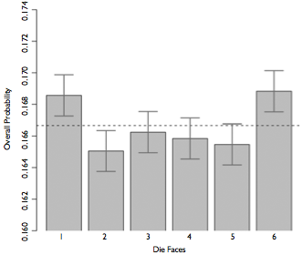

```{r setup, include = FALSE}
# remotes::install_github("gadenbuie/countdown")
# remotes::install_github("mitchelloharawild/icon")
# icon::download_fontawesome()
library(knitr)
library(tidyverse)
library(countdown)
library(openintro)
library(DATA606)
library(reshape2)
library(latex2exp)
library(psych)

knitr::opts_chunk$set(warning = FALSE, message = FALSE, error = FALSE, 
					  fig.width = 12, fig.height=6, fig.align = 'center',
					  digits = 3) 
options(width = 120)
# The following is to fix a DT::datatable issue with Xaringan
# https://github.com/yihui/xaringan/issues/293
options(htmltools.dir.version = FALSE, htmltools.preserve.raw = FALSE)

# This style was adapted from Max Kuhn: https://github.com/rstudio-conf-2020/applied-ml
# And Rstudio::conf 2020: https://github.com/rstudio-conf-2020/slide-templates/tree/master/xaringan
# This slide deck shows a lot of the features of Xaringan: https://www.kirenz.com/slides/xaringan-demo-slides.html

# To use, add this to the slide title:   `r I(hexes(c("DATA606")))`
# It will use images in the images/hex_stickers directory (i.e. the filename is the paramter)
hexes <- function(x) {
  x <- rev(sort(x))
  markup <- function(pkg) glue::glue('')
  res <- purrr::map_chr(x, markup)
  paste0(res, collapse = "")
}

# Cartoons from https://github.com/allisonhorst/stats-illustrations
# dplyr based upon https://allisonhorst.shinyapps.io/dplyr-learnr/#section-welcome
```

# Agenda

* Tip for debugging R markdown
* Review CLT / Questions
* Bootstrapping
* Inference for Categorical Variables
* Inference for Numerical Variables
* One minute papers


---
# Debugging R Markdown

* Click Tools -> Global Options
	* Under Workspace, uncheck *Restore .RData into workspace at startup*
	* For *Save workspace to .RData on ext*, choose *Never*
* When you encounter an error, or before you are done, it is good to rerun the document from a clean slate. Click Session -> Restart R. This will unload all packages and any data. You can then start from the top of the document.
	* If there is a particular R chunk that is causing an issue, click this icon to run all R code up to the current R chunk .
	* Then you can click this icon to run the current R chunk 
* Getting figures and output to show up. Change the following line towards the top of the RMarkdown:

```
knitr::opts_chunk$set(eval = TRUE, results = FALSE, fig.show = "hide", message = FALSE, warning = FALSE)
```

to

```
knitr::opts_chunk$set(eval = TRUE, message = FALSE, warning = FALSE)
```

Note that this has been fixed for the labs going forward.

---
# Central Limit Theorem (CLT)

The distribution of the sample mean is well approximated by a normal model:

$$ \bar { x } \sim N\left( mean=\mu ,SE=\frac { \sigma  }{ \sqrt { n }  }  \right)  $$

where SE represents the **standard error**, which is defined as the standard deviation of the sampling distribution. In most cases $\sigma$ is not known, so use $s$.


---
class: font120
# Null Hypothesis Testing

* We start with a null hypothesis ( $H_0$ ) that represents the status quo.
* We also have an alternative hypothesis ( $H_A$ ) that represents our research question, i.e. what we're testing for.
* We conduct a hypothesis test under the assumption that the null hypothesis is true, either via simulation or traditional methods based on the central limit theorem.
* If the test results suggest that the data do not provide convincing evidence for the alternative hypothesis, we stick with the null hypothesis. If they do, then we reject the null hypothesis in favor of the alternative.


---
class: center, middle, inverse
# Bootstrapping 


---
# Bootstrapping

* First introduced by Efron (1979) in [*Bootstrap Methods: Another Look at the Jackknife*](https://projecteuclid.org/euclid.aos/1176344552).
* Estimates confidence of statistics by resampling *with* replacement.
* The *bootstrap sample* provides an estimate of the sampling distribution.
* The `boot` R package provides a framework for doing bootstrapping: https://www.statmethods.net/advstats/bootstrapping.html

---
# Bootstrapping Example (Population)

Define our population with a uniform distribution.

```{r}
n <- 1e5
pop <- runif(n, 0, 1)
mean(pop)
```

```{r, echo=FALSE, fig.height=5}
d <- density(pop)
h <- hist(pop, plot=FALSE)
hist(pop, main='Population Distribution', xlab="", freq=FALSE, 
     ylim=c(0, max(d$y, h$density)+.5), col=COL[1,2], border = "white", 
	 cex.main = 1.5, cex.axis = 1.5, cex.lab = 1.5)
lines(d, lwd=3)
```

---
# Bootstrapping Example (Sample)

We observe one random sample from the population.

```{r}
samp1 <- sample(pop, size = 50)
```

```{r, echo=FALSE}
d <- density(samp1)
h <- hist(samp1, plot=FALSE)
hist(samp1, main='Distribution of Sample', xlab="", freq=FALSE, 
     ylim=c(0, max(d$y, h$density)+.5), col=COL[1,2], border = "white", 
	 cex.main = 1.5, cex.axis = 1.5, cex.lab = 1.5)
lines(d, lwd=3)
```

---
# Bootsrapping Example (Estimate)

```{r}
boot.samples <- numeric(1000) # 1,000 bootstrap samples
for(i in seq_along(boot.samples)) { 
	tmp <- sample(samp1, size = length(samp1), replace = TRUE)
	boot.samples[i] <- mean(tmp)
}
head(boot.samples)
```

---
# Bootsrapping Example (Distribution)

```{r, fig.height = 6}
d <- density(boot.samples)
h <- hist(boot.samples, plot=FALSE)
hist(boot.samples, main='Bootstrap Distribution', xlab="", freq=FALSE, 
     ylim=c(0, max(d$y, h$density)+.5), col=COL[1,2], border = "white", 
	 cex.main = 1.5, cex.axis = 1.5, cex.lab = 1.5)
lines(d, lwd=3)
```

---
# 95% confidence interval

```{r}
c(mean(boot.samples) - 1.96 * sd(boot.samples), 
  mean(boot.samples) + 1.96 * sd(boot.samples))
```

---
# Bootstrapping is not just for means!

```{r}
boot.samples.median <- numeric(1000) # 1,000 bootstrap samples
for(i in seq_along(boot.samples.median)) { 
	tmp <- sample(samp1, size = length(samp1), replace = TRUE)
	boot.samples.median[i] <- median(tmp) # NOTICE WE ARE NOW USING THE median FUNCTION!
}
head(boot.samples.median)
```

95% confidence interval for the median

```{r}
c(mean(boot.samples.median) - 1.96 * sd(boot.samples.median), 
  mean(boot.samples.median) + 1.96 * sd(boot.samples.median))
```


---
class: center, middle, inverse
# Inference for Categorical Variables

---
# Example

Two scientists want to know if a certain drug is effective against high blood pressure. The first scientist wants to give the drug to 1,000 people with high blood pressure and see how many of them experience lower blood pressure levels. The second scientist wants to give the drug to 500 people with high blood pressure, and not give the drug to another 500 people with high blood pressure, and see how many in both groups experience lower blood pressure levels. Which is the better way to test this drug?

>- **500 get the drug, 500 don't**

---
# Survey of Americans

The GSS asks the same question, below is the distribution of responses from the 2010 survey:

Response                   | n
---------------------------|------
All 1000 get the drug      | 99 
500 get the drug 500 don't | 571
**Total**                  | **670**

---
# Parameter of Interest

* Parameter of interest: Proportion of *all* Americans who have good intuition about experimental design.  
$$p(population\; proportion)$$

* Point estimate: Proportion of *sampled* Americans who have good
intuition about experimental design.  
$$\hat{p}(sample\; proportion)$$

---
# Inference for a proportion

What percent of all Americans have good intuition about experimental design (i.e. would answer "500 get the drug 500 don't?"

* Using a confidence interval
$$point\; estimate \pm ME$$

* We know that ME = critical value x standard error of the point estimate.
$$SE_{\hat{p}} = \sqrt{\frac{p(1-p)}{n}}$$

---
# Central limit theoreom for proportions

Sample proportions will be nearly normally distributed with mean equal to the population mean, *p*, and standard error equal to $\sqrt{\frac{p(1-p)}{n}}$.

$$\hat { p } \sim N\left( mean=p,SE=\sqrt { \frac { p(1-p) }{ n }  }  \right) $$

This is true given the following conditions:

* independent observations
* at least 10 successes and 10 failures

---
# Back to the Survey

* 571 out of 670 (85%) of Americans answered the question on experimental design correctly.
* Estimate (using a 95% confidence interval) the proportion of all Americans who have good intuition about experimental design?

Given: $n = 670$, $\hat{p} = 0.85$.

Conditions:

1. Independence: The sample is random, and 670 < 10% of all Americans, therefore we can assume that one respondent's response is independent of another.

2. Success-failure: 571 people answered correctly (successes) and 99 answered incorrectly (failures), both are greater than 10.

---
# Calculating Confidence Interval

Given: $n = 670$, $\hat{p} = 0.85$.

$$0.85 \pm 1.96 \sqrt{\frac{0.85 \times 0.15}{670}} = \left(0.82,\; 0.88\right)$$

We are 95% confidence the true proportion of Americans that have a good intuition about experimental designs is betwee 82% and 88%.

---
# How many should we sample?

Suppose you want a 3% margin of error, how many people would you have to survey?

Use $\hat{p} = 0.5$

* If you don't know any better, 50-50 is a good guess
* $\hat{p} = 0.5$ gives the most conservative estimate - highest possible sample size

$$0.03 = 1.96 \times \sqrt{\frac{0.5 \times 0.5}{n}}$$
$$0.03^2 = 1.96^2 \times \frac{0.5 \times 0.5}{n}$$
$$n \approx 1,068$$

---
# Example: Two Proportions

Scientists predict that global warming may have big effects on the polar regions within the next 100 years. One of the possible effects is that the northern ice cap may completely melt. Would this bother you a great deal, some, a little, or not at all if it actually happened?

Response     | GSS | Duke
-------------|----:|-----:
A great deal | 454 |  69
Some         | 124 |  40
A little     |  52 |   4
Not at all   |  50 |   2
Total        | 680 | 105

---
# Parameter and Point Estimate

Parameter of interest: Difference between the proportions of *all* Duke students and *all* Americans who would be bothered a great deal by the northern ice cap completely melting.

$$p_{Duke} - p_{US}$$

Point estimate: Difference between the proportions of *sampled* Duke students and *sampled* Americans who would be bothered a great deal by the northern ice cap completely melting.

$$\hat{p}_{Duke} - \hat{p}_{US}$$

---
# Everything else is the same...

* CI: $point\; estimate \pm margin\; of\; error$
* HT: $Z = \frac{point\; estimate - null\; value}{SE}$

Standard error of the difference between two sample proportions

$$SE_{\hat{p}_1 - \hat{p}_2} = \sqrt{ \frac{p_1\left(1 - p_1\right)}{n_1} + \frac{p_2\left(1 - p_2\right)}{n_2} }$$

Conditions:

1. Independence within groups: The US group is sampled randomly and we're assuming that the Duke group represents a random sample as well. $n_{Duke} < 10\%$ of all Duke students and $680 < 10\%$ of all Americans.
2. Independence between groups: The sampled Duke students and the US residents are independent of each other.
3. Success-failure: At least 10 observed successes and 10 observed failures in the two groups.

---
# 95% Confidence Interval

Construct a 95% confidence interval for the difference between the proportions of Duke students and Americans who would be bothered a great deal by the melting of the northern ice cap ( $p_{Duke} - p_{US}$ ).

Data             |  Duke |  US
-----------------|------:|-----:
A great deal     |   69  | 454
Not a great deal |   36  | 226
Total            |  105  | 680
$\hat{p}$        | 0.657 | 0.668

$$\left(\hat{p}_{Duke} - \hat{p}_{US}\right) \pm z* \times \sqrt{ \frac{p_{Duke}\left(1 - p_{Duke}\right)}{n_{Duke}} + \frac{p_{US}\left(1 - p_{US}\right)}{n_{US}} }$$

$$(0.657 - 0.668) \pm 1.96 \times \sqrt{\frac{0.657 \times 0.343}{105} + \frac{0.668 \times 0.332}{680}} = \left(-0.108,\; 0.086\right)$$

---
# Weldon's dice

* Walter Frank Raphael Weldon (1860 - 1906), was an English evolutionary biologist and a founder of biometry. He was the joint founding editor of Biometrika, with Francis Galton and Karl Pearson.
* In 1894, he rolled 12 dice 26,306 times, and recorded the number of 5s or 6s (which he considered to be a success).
	* It was observed that 5s or 6s occurred more often than expected, and Pearson hypothesized that this was probably due to the construction of the dice. Most inexpensive dice have hollowed-out pips, and since opposite sides add to 7, the face with 6 pips is lighter than its opposing face, which has only 1 pip.

---
# Labby's dice

In 2009, Zacariah Labby (U of Chicago), repeated Weldon’s experiment using a homemade dice-throwing, pip counting machine. http://www.youtube.com/watch?v=95EErdouO2w

* The rolling-imaging process took about 20 seconds per roll.
	* Each day there were ∼150 images to process manually.
	* At this rate Weldon’s experiment was repeated in a little more than six full days.
	* Recommended reading: http://galton.uchicago.edu/about/docs/labby09dice.pdf

.center[]
---
# Summarizing Labby's results

The table below shows the observed and expected counts from Labby's experiment.


| Outcome   | Observed	  | Expected    |
|-----------|-------------|-------------|
| 1	        | 53,222      | 52,612      | 
| 2	        | 52,118      | 52,612      | 
| 3	        | 52,465      | 52,612      | 
| 4	        | 52,338      | 52,612      | 
| 5	        | 52,244      | 52,612      | 
| 6	        | 53,285      | 52,612      | 
| Total     | 315,672     | 315,672     |

---
# Setting the hypotheses

Do these data provide convincing evidence of an inconsistency between the observed and expected counts?

* $H_0$: There is no inconsistency between the observed and the expected counts. The observed counts follow the same distribution as the expected counts.

* $H_A$: There is an inconsistency between the observed and the expected counts. The observed counts **do not** follow the same distribution as the expected counts. There is a bias in which side comes up on the roll of a die.

---
# Evaluating the hypotheses

* To evaluate these hypotheses, we quantify how different the observed counts are from the expected counts. 
* Large deviations from what would be expected based on sampling variation (chance) alone provide strong evidence for the alternative hypothesis.
* This is called a \hl{goodness of fit} test since we're evaluating how well the observed data fit the expected distribution.

---
# Anatomy of a test statistic

* The general form of a test statistic is:

$$\frac{\text{point estimate} - \text{null value}}{\text{SE of point estimate}}$$

* This construction is based on 
	1. identifying the difference between a point estimate and an expected value if the null hypothesis was true, and 
	2. standardizing that difference using the standard error of the point estimate. 

* These two ideas will help in the construction of an appropriate test statistic for count data.


---
# Chi-Squared

When dealing with counts and investigating how far the observed counts are from the expected counts, we use a new test statistic called the chi-square ( $\chi^2$ ) statistic.

.pull-left[
$$\chi^2 = \sum_{i = 1}^k \frac{(O - E)^2}{E}$$
where k = total number of cells

]
.pull-right[

| Outcome   | Observed	  | Expected    | $\frac{(O - E)^2}{E}$
|-----------|-------------|-------------|-----------------------|
| 1	        | 53,222      | 52,612      | $\frac{(53,222 - 52,612)^2}{52,612} = 7.07$ |
| 2	        | 52,118      | 52,612      | $\frac{(52,118 - 52,612)^2}{52,612} = 4.64$ |
| 3	        | 52,465      | 52,612      | $\frac{(52,465 - 52,612)^2}{52,612} = 0.41$ |
| 4	        | 52,338      | 52,612      | $\frac{(52,338 - 52,612)^2}{52,612} = 1.43$ |
| 5	        | 52,244      | 52,612      | $\frac{(52,244 - 52,612)^2}{52,612} = 2.57$ |
| 6	        | 53,285      | 52,612      | $\frac{(53,285 - 52,612)^2}{52,612} = 8.61$ |
| Total     | 315,672     | 315,672     | 24.73 |

]

---
# Chi-Squared Distribution

Squaring the difference between the observed and the expected outcome does two things:

*  Any standardized difference that is squared will now be positive.
*  Differences that already looked unusual will become much larger after being squared.

In order to determine if the $\chi^2$ statistic we calculated is considered unusually high or not we need to first describe its distribution.

* The chi-square distribution has just one parameter called **degrees of freedom (df)**, which influences the shape, center, and spread of the distribution.

```{r, echo=FALSE, fig.align='center', fig.height=3}
COL <- c('#225588', '#558822CC', '#88225599', '#88552266')

par(mar=c(2, 0.5, 0.25, 0.5), mgp=c(2.1, 0.8, 0), las=1)
x <- c(0, seq(0.0000001, 40, 0.05))
DF <- c(2.0000001, 4, 9)
y <- list()
for(i in 1:length(DF)){
	y[[i]] <- dchisq(x, DF[i])
}
plot(0, 0, type='n', xlim=c(0, 25), ylim=range(c(y, recursive=TRUE)), axes=FALSE)
for(i in 1:length(DF)){
	lines(x, y[[i]], lty=i, col=COL[i], lwd=3)
}
abline(h=0)
axis(1)

legend('topright', col=COL, lty=1:4, legend=paste(round(DF) ), title='Degrees of Freedom', cex=1, lwd = 3)
```

---
# Degrees of freedom for a goodness of fit test

When conducting a goodness of fit test to evaluate how well the observed data follow an expected distribution, the degrees of freedom are calculated as the number of cells ($k$) minus 1.

$$df = k - 1$$

For dice outcomes, $k = 6$, therefore $df = 6 - 1 = 5$


```{r, echo=FALSE, fig.height=3}
openintro::ChiSquareTail(df = 5, U = 24.67, xlim = c(0, 30))
```

p-value = $P(\chi^2_{df = 5} > 24.67)$ is less than 0.001


---
# Turns out...

.font140[
* The 1-6 axis is consistently shorter than the other two (2-5 and 3-4), thereby supporting the hypothesis that the faces with one and six pips are larger than the other faces.
* Pearson's claim that 5s and 6s appear more often due to the carved-out pips is not supported by these data.
* Dice used in casinos have flush faces, where the pips are filled in with a plastic of the same density as the surrounding material and are precisely balanced.
]

---
# Recap: p-value for a chi-square test

* The p-value for a chi-square test is defined as the tail area **above** the calculated test statistic.

* This is because the test statistic is always positive, and a higher test statistic means a stronger deviation from the null hypothesis.


```{r, echo=FALSE, fig.height=6}
openintro::ChiSquareTail(df = 6, U = 10, showdf = FALSE, axes = FALSE, xlim = c(0, 15) )
text(x = 12, y = 0.005, "p-value", col = "red", cex = 1)
```


---
# Independence Between Groups

.pull-left[
Assume we have a population of 100,000 where groups A and B are independent with $p_A = .55$ and $p_B = .6$ and $n_A = 99,000$ (99% of the population) and $n_B = 1,000$ (1% of the population). We can sample from the population (that includes groups A and B) and from group B of sample sizes of 1,000 and 100, respectively. We can also calculate $\hat{p}$ for group A independent of B.
```{r}
propA <- .55    # Proportion for group A
propB <- .6     # Proportion for group B
pop.n <- 100000 # Population size
sampleA.n <- 1000
sampleB.n <- 100
```
]

.pull-right[.code90[
```{r}
pop <- data.frame(
	group = c(rep('A', pop.n * 0.99),
			  rep('B', pop.n * 0.01) ),
	response = c(
		sample(c(1,0), 
			   size = pop.n * 0.99, 
			   prob = c(propA, 1 - propA), 
			   replace = TRUE),
		sample(c(1,0), 
			   size = pop.n * 0.01, 
			   prob = c(propB, 1 - propB), 
			   replace = TRUE) )
)
sampA <- pop[sample(nrow(pop), 
					size = sampleA.n),]
sampB <- pop[sample(which(pop$group == 'B'), 
					size = sampleB.n),]
```
] ]

---
# Independence Between Groups (cont.)

$\hat{p}$ for the population sample

```{r}
mean(sampA$response)

```

$\hat{p}$ for the population sample, excluding group B 

```{r}
mean(sampA[sampA$group == 'A',]$response)
```

$\hat{p}$ for group B sample

```{r}
mean(sampB$response)
```

---
# Independence Between Groups (cont.)

```{r, message=FALSE, warning=FALSE, cache=TRUE, include=FALSE}
propA <- .55 # Proportion for group A
propB <- .6 # Proportion for group B
pop.n <- 100000 # Population size
sampleA.n <- 1000
sampleB.n <- 1000

replications <- 10 

results <- data.frame(
	percent = rep(seq(0.01, 0.5, 0.01), each = replications),
	p_hat_pop = NA_real_,
	p_hat_popA = NA_real_,
	p_hat_popB = NA_real_,
	p_hat_A = NA_real_,
	p_hat_A_not_B = NA_real_,
	p_hat_B = NA_real_
)

for(i in seq_len(nrow(results))) {
	A.n <- pop.n * (1 - results[i,]$percent)
	B.n <- pop.n * results[i,]$percent
	
	pop <- data.frame(
		group = c(rep('A', A.n),
				  rep('B', B.n) ),
		response = c(
			sample(c(1,0), 
				   size = A.n, 
				   prob = c(propA, 1 - propA), 
				   replace = TRUE),
			sample(c(1,0), 
				   size = B.n, 
				   prob = c(propB, 1 - propB), 
				   replace = TRUE) )
	)
	
	tmp <- aggregate(pop$response, by = list(pop$group), FUN = mean)
	results[i,]$p_hat_pop <- mean(pop$response)
	results[i,]$p_hat_popA <- tmp[1,]$x
	results[i,]$p_hat_popB <- tmp[2,]$x
	
	sampA <- pop[sample(nrow(pop), size = sampleA.n),]
	sampB <- pop[sample(which(pop$group == 'B'), size = sampleB.n),]
	
	results[i,]$p_hat_A <- mean(sampA$response)
	results[i,]$p_hat_A_not_B <- mean(sampA[sampA$group == 'A',]$response)
	results[i,]$p_hat_B <- mean(sampB$response)
}

results.melt <- melt(results[,c(1,5,6,7)], 
					 id.vars = 'percent', 
					 value.name = 'p_hat')
```

```{r, echo=FALSE, fig.width=12, fig.height=7, results = 'hide'}
ggplot(results.melt, aes(x = percent, y = p_hat, color = variable)) + 
	geom_hline(yintercept = propA) +
	geom_hline(yintercept = propB) + 
	geom_point(alpha = 0.2) + 
	geom_smooth(se = TRUE, method = 'loess', formula = y ~ x) +
	scale_color_brewer('', palette = 2, type = 'qual') +
	xlab('Size of group B as a percentage of population') +
	ylab(TeX('$\\hat{p}$'))
```


---
class: inverse, center, middle
# Inference for Numerical Variables


---
# High School & Beyond Survey  

`r nrow(hsb2)` randomly selected students completed the reading and writing test of the High School and Beyond survey. The results appear to the right. Does there appear to be a difference?

```{r, fig.width=5, fig.height=4, eval=TRUE}
data(hsb2) # in openintro package
hsb2.melt <- melt(hsb2[,c('id','read', 'write')], id='id')
ggplot(hsb2.melt, aes(x=variable, y=value)) + 	geom_boxplot() + 
	geom_point(alpha=0.2, color='blue') + xlab('Test') + ylab('Score')
```


---
# High School & Beyond Survey  

```{r}
head(hsb2)
```

Are the reading and writing scores of each student independent of each other?


---
# Analyzing Paired Data  

* When two sets of observations are not independent, they are said to be paired.
* To analyze these type of data, we often look at the difference.

```{r, fig.width=8, fig.height=4}
hsb2$diff <- hsb2$read - hsb2$write
head(hsb2$diff)
```

```{r, fig.width=6, fig.height=3}
hist(hsb2$diff)
```


---
# Setting the Hypothesis

What are the hypothesis for testing if there is a difference between the average reading and writing scores?

$H_0$: There is no difference between the average reading and writing scores.

$$\mu_{diff} = 0$$

$H_A$: There is a difference between the average reading and writing score.

$$\mu_{diff} \ne 0$$

---
# Nothing new here...

.font140[
* The analysis is no different that what we have done before.
* We have data from one sample: differences.
* We are testing to see if the average difference is different that 0.
]

---
# Calculating the test-statistic and the p-value 

.font120[
The observed average difference between the two scores is `r mean(hsb2$diff)` points and the standard deviation of the difference is `r sd(hsb2$diff)` points. Do these data provide confincing evidence of a difference between the average scores ont eh two exams (use $\alpha = 0.05$)?
]

```{r, fig.width=10, fig.height=5, echo=FALSE}
meanDiff <- mean(hsb2$diff)
sdDiff <- sd(hsb2$diff)
normalPlot(mean=0, bounds=c(-1 * abs(meanDiff), abs(meanDiff)), tails=TRUE)
```

---
# Calculating the test-statistic and the p-value 

$$Z = \frac{-0.545 - 0}{ \frac{8.887}{\sqrt{200}} } = \frac{-0.545}{0.628} = -0.87$$
$$p-value = 0.1949 \times 2 = 0.3898$$

Since p-value > 0.05, we fail to reject the null hypothesis. That is, the data do not provide evidence that there is a statistically significant difference between the average reading and writing scores.

```{r}
2 * pnorm(mean(hsb2$diff), mean=0, sd=sd(hsb2$diff)/sqrt(nrow(hsb2)))
```

---
# Interpretation of the p-value

The probability of obtaining a random sample of 200 students where the average difference between the reading and writing scores is at least 0.545 (in either direction), if in fact the true average difference between the score is 0, is 38%.

---
# Calculating 95% Confidence Interval

$$-0.545\pm 1.96\frac { 8.887 }{ \sqrt { 200 }  } =-0.545\pm 1.96\times 0.628=(-1.775, 0.685)$$

Note that the confidence interval spans zero!

---
# SAT Scores by Gender

```{r}
data(sat)
head(sat)
```

```{r, echo=FALSE, results='hide', warning=FALSE}
sat$Math.SAT <- as.integer(sat$Math.SAT)
sat <- sat[complete.cases(sat),]
```

Is there a difference in math scores between males and females?

---
# SAT Scores by Gender 


```{r}
describeBy(sat$Math.SAT, group=sat$Sex, mat=TRUE, skew=FALSE)[,c(2,4:7)]
```

```{r, fig.width=4.5, fig.height=3}
ggplot(sat, aes(x=Sex, y=Math.SAT)) + geom_boxplot()
```

---
# Distributions  


```{r, fig.width=10, fig.height=6}
ggplot(sat, aes(x=Math.SAT)) + geom_histogram(binwidth=50) + facet_wrap(~ Sex)
```

---
# 95% Confidence Interval

We wish to calculate a 95% confidence interval for the average difference between SAT scores for males and females.

Assumptions:

1. Independence within groups.
2. Independence between groups.
3. Sample size/skew

---
# Confidence Interval for Difference Between Two Means

* All confidence intervals have the same form: point estimate X ME
* And all ME = critical value X SE of point estimate
* In this case the point estimate is $\bar{x}_1 - \bar{x}_2$
Since the sample sizes are large enough, the critical value is z*
So the only new concept is the standard error of the difference between two means...

Standard error of the difference between two sample means

$$SE_{ (\bar { x } _{ 1 }-\bar { x } _{ 2 }) }=\sqrt { \frac { { s }_{ 1 }^{ 2 } }{ { n }_{ 1 } } +\frac { { s }_{ 2 }^{ 2 } }{ { n }_{ 2 } }  }$$


---
# Confidence Interval for Difference in SAT Scores

$$SE_{ (\bar { x } _{ 1 }-\bar { x } _{ 2 }) }=\sqrt { \frac { { s }_{ M }^{ 2 } }{ { n }_{ M } } + \frac { { s }_{ F }^{ 2 } }{ { n }_{ F } }  } = \sqrt { \frac { 90.4 }{ 80 } +\frac { 103.7 }{ 82 }  } =1.55$$

---
# Student's *t*-Distribution

.pull-left[
What if you want to compare the quality of one batch of Guinness beer to the next?

* Sample sizes necessarily need to be small.
* The CLT states that the sampling distribution approximates normal as n -> Infinity
* Need an alternative to the normal distribution.
* The *t* distribution was developed by William Gosset (under the pseudonym *student*) to estimate means when the sample size is small.

Confidence interval is estimated using

$$\overline { x } \pm { t }_{ df }^{ * }SE$$

Where *df* is the degrees of freedom (*df* = *n* -1)
]
.pull-right[.center[

]]

---
# *t*-Distributions

```{r, echo=FALSE}
x <- seq(-4, 4, length=100)
hx <- dnorm(x)

degf <- c(1, 3, 8, 30)
colors <- c("red", "blue", "darkgreen", "gold", "black")
labels <- c("df=1", "df=3", "df=8", "df=30", "normal")

plot(x, hx, type="l", lty=2, xlab="x value",
  ylab="Density", main="Comparison of t Distributions")

for (i in 1:4){
  lines(x, dt(x,degf[i]), lwd=2, col=colors[i])
}

legend("topright", inset=.05, title="Distributions", labels, lwd=2, lty=c(1, 1, 1, 1, 2), col=colors)
```

---
# *t*-test in R

The `pt` and `qt` will give you the *p*-value and critical value from the *t*-distribution, respectively.

.pull-left[
Critical value for p = 0.05, degrees of freedom = 10

```{r}
qt(0.025, df = 10)
```

p-value for a critical value of 2, degrees of freedom = 10

```{r}
pt(2, df=10)
```

]
.pull-right[

The `t.test` function will calculate a null hyphothesis test using the *t*-distribution.

```{r}
t.test(Math.SAT ~ Sex, data = sat)
```
]


---
# Review: Sampling Distribution

```{r, echo=FALSE, fig.align='center', warning=FALSE, message=FALSE}
set.seed(123)
n <- 1e5
pop2 <- runif(n, 0, 5)
# pop2 <- rnorm(n, mean = 100, sd = 15)
samp <- sample(pop2, size = 30)
se <- sd(samp) / sqrt(length(samp))

hist.samp <- density(samp, 
				  from = mean(samp) - 1.96 * sd(samp), 
				  to = mean(samp) + 1.96 * sd(samp))
hist.samp <- data.frame(x = hist.samp$x, y = hist.samp$y)
hist.sampdist <- data.frame(x = seq(mean(samp) - 1.96 * se,
									mean(samp) + 1.96 * se, 0.01))
hist.sampdist$y <- dnorm(hist.sampdist$x, mean = mean(samp), sd = se)


ggplot(data = data.frame(x = range(samp)), aes(x)) +
	geom_density(data = data.frame(x = pop2), alpha = 0.2) +
	geom_vline(xintercept = mean(pop2)) +
	xlim(mean(samp) - 3 * sd(samp), mean(samp) + 3 * sd(samp)) + ylab("") +
	ylim(c(0, max(hist.sampdist$y))) +
	theme(axis.text.y = element_blank(), axis.ticks.y = element_blank()) +
	ggtitle('Distribution of Population (in black)',
			subtitle = paste0('Population mean = ', round(mean(pop2), digits = 3), 
							  ' sample n = ', length(samp), ''))
```

---
# Review: Sampling Distribution

```{r, echo=FALSE, fig.align='center', warning=FALSE, message=FALSE}
ggplot(data = data.frame(x = range(samp)), aes(x)) +
	geom_density(data = data.frame(x = pop2), alpha = 0.2) +
	geom_vline(xintercept = mean(pop2)) +
	geom_ribbon(data = hist.samp, aes(x = x, ymin = 0, ymax = y), fill = 'blue', alpha = 0.5) +
	geom_density(data = data.frame(x = samp), color = 'blue') +
	xlim(mean(samp) - 3 * sd(samp), mean(samp) + 3 * sd(samp)) + ylab("") +
	ylim(c(0, max(hist.sampdist$y))) + 
	theme(axis.text.y = element_blank(), axis.ticks.y = element_blank()) +
		ggtitle('Distribution of Population (in black), Sample (in blue)',
			subtitle = paste0('Population mean = ', round(mean(pop2), digits = 3), 
							  ' sample n = ', length(samp), ''))
```


---
# Review: Sampling Distribution

```{r, echo=FALSE, fig.align='center', warning=FALSE, message=FALSE}
ggplot(data = data.frame(x = range(samp)), aes(x)) +
	geom_density(data = data.frame(x = pop2), alpha = 0.2) +
	geom_vline(xintercept = mean(pop2)) +
	geom_ribbon(data = hist.samp, aes(x = x, ymin = 0, ymax = y), fill = 'blue', alpha = 0.5) +
	geom_density(data = data.frame(x = samp), color = 'blue') +
	geom_ribbon(data = hist.sampdist, aes(x = x, ymin = 0, ymax = y), fill = 'maroon', alpha = 0.5) +
	stat_function(fun = dnorm, n = 1000,
				  args = list(mean = mean(samp), sd = se), color = 'maroon') +
	xlim(mean(samp) - 3 * sd(samp), mean(samp) + 3 * sd(samp)) + ylab("") +
	ylim(c(0, max(hist.sampdist$y))) +
	theme(axis.text.y = element_blank(), axis.ticks.y = element_blank()) +
	ggtitle('Distribution of Population (in black), Sample (in blue), and Sampling Distribution (in maroon)',
			subtitle = paste0('Population mean = ', round(mean(pop2), digits = 3), 
							  ' sample n = ', length(samp), ''))
```

---
# Review: Add Bootstrap Distribution

```{r, echo=FALSE, fig.align='center', warning=FALSE, message=FALSE}
pop_mean <- mean(pop2)
boot.samples <- numeric(1000) # 1,000 bootstrap samples
for(i in seq_along(boot.samples)) { 
	tmp <- sample(samp, size = length(samp1), replace = TRUE)
	boot.samples[i] <- mean(tmp)
}
hist.boot <- data.frame(x = seq(mean(boot.samples) - 1.96 * sd(boot.samples),
								mean(boot.samples) + 1.96 * sd(boot.samples), 0.01))
hist.boot$y <- dnorm(hist.boot$x, mean = mean(boot.samples), sd = sd(boot.samples))
ggplot(data = data.frame(x = pop2)) +
	geom_density(data = data.frame(x = pop2), aes(x = x), alpha = 0.2) +
	geom_vline(xintercept = pop_mean) +
	geom_ribbon(data = hist.boot, aes(x = x, ymin = 0, ymax = y), fill = 'green', alpha = 0.5) +
	geom_density(data = data.frame(x = boot.samples), aes(x = x), color = 'green') +
	geom_ribbon(data = hist.samp, aes(x = x, ymin = 0, ymax = y), fill = 'blue', alpha = 0.5) +
	geom_density(data = data.frame(x = samp), aes(x = x), color = 'blue') +
	geom_ribbon(data = hist.sampdist, aes(x = x, ymin = 0, ymax = y), fill = 'maroon', alpha = 0.5) +
	stat_function(fun = dnorm, n = 1000,
				  args = list(mean = mean(samp), sd = se), color = 'maroon') +
	xlim(mean(samp) - 3 * sd(samp), mean(samp) + 3 * sd(samp)) + ylab("") +
	ylim(c(0, max(c(hist.sampdist$y, hist.boot$y)))) +
	theme(axis.text.y = element_blank(), axis.ticks.y = element_blank()) +
	ggtitle('Distribution of Population (in black), Sample (in blue), and Sampling Distribution (in maroon)',
			subtitle = paste0('Population mean = ', round(mean(pop2), digits = 3), 
							  ' sample n = ', length(samp), ''))
```

---
# Assignments

Lab 5 is in two parts: A) Sampling Distributions and B) Confidence Levels. To get started, run the following commands:

```{r, eval=FALSE}
DATA606::startLab('Lab5a') # https://r.bryer.org/shiny/Lab5a/
DATA606::startLab('Lab5b') # https://r.bryer.org/shiny/Lab5b/
```


---
class: left
# One Minute Paper

.font140[
Complete the one minute paper: 
https://forms.gle/yB3ds6MYE89Z1pURA

1. What was the most important thing you learned during this class?
2. What important question remains unanswered for you?
]

 
